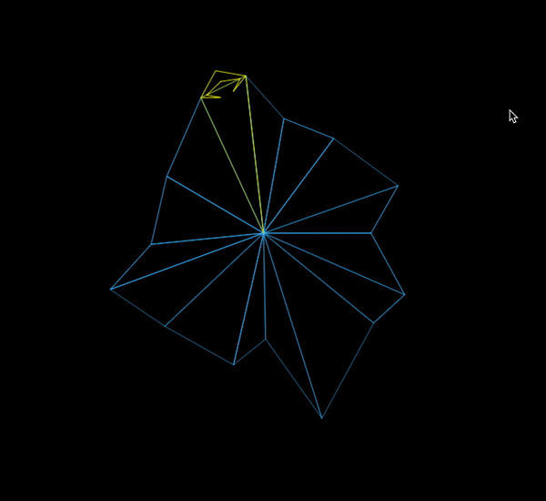

Once, at an arcade bar, I saw someone play this game and loved the graphics, so I'm trying to clone it as a HTML5 game. WIP.

In the project directory, you can run:

### `npm start`

Runs the app in the development mode. 
Open [http://localhost:3000](http://localhost:3000) to view it in the browser.

You should see something like this:

